# Figures and diagrams (lecture-ready)

All diagrams are **Mermaid**. Paste into slides or [mermaid.live](https://mermaid.live). Suggested spoken script is under each figure.

Color convention: **blue** = project/control, **green** = network, **orange** = data, **red** = untrusted.

---

## F1 — Cloud service models

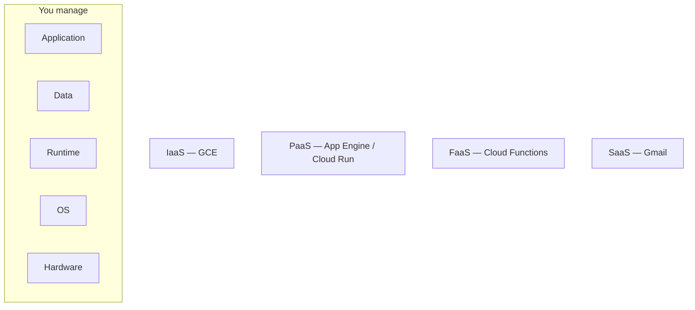

**Better teaching version (stacked responsibility):**

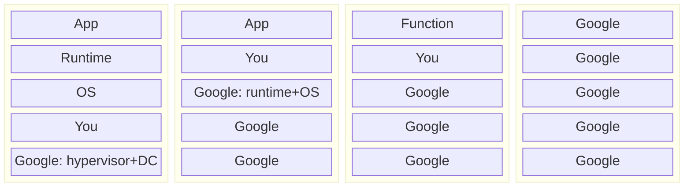

**Say:** “Moving right, you trade control for undifferentiated heavy lifting. You never outsource **your** authorization bugs.”

---

## F2 — Regions, zones, edge

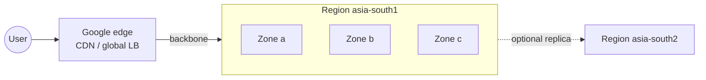

**Say:** “A zone is a failure domain. A region is a latency and residency domain. The edge is where TLS dies and caches live.”

---

## F3 — Resource hierarchy and IAM inheritance

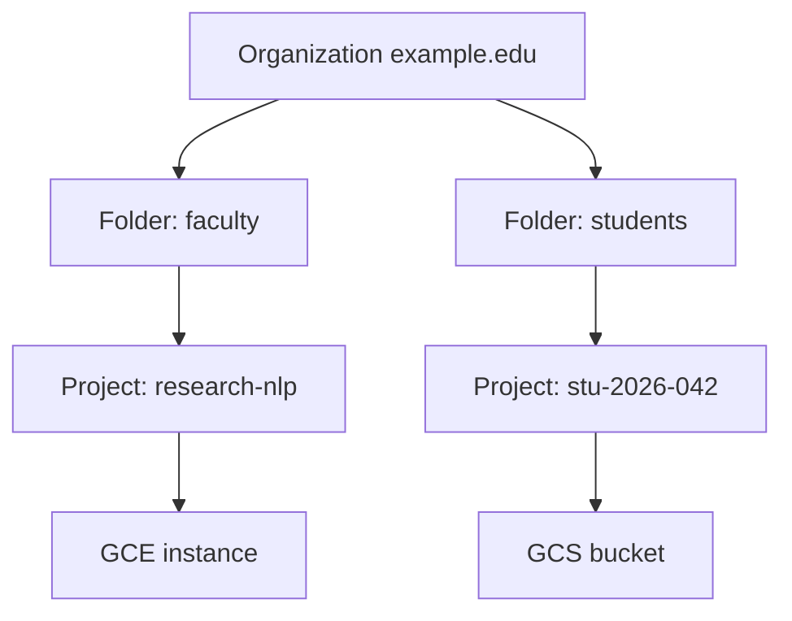

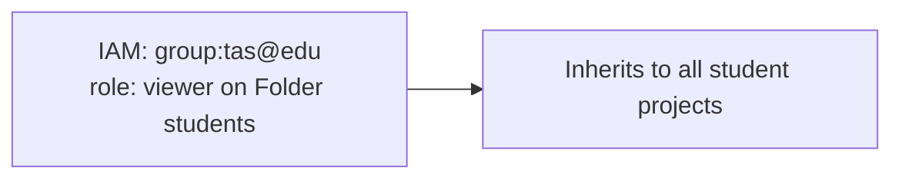

**Say:** “Grant at the highest correct node. A Viewer on the student folder sees every lab project — that may be intended for TAs, never for the public.”

---

## F4 — Shared responsibility

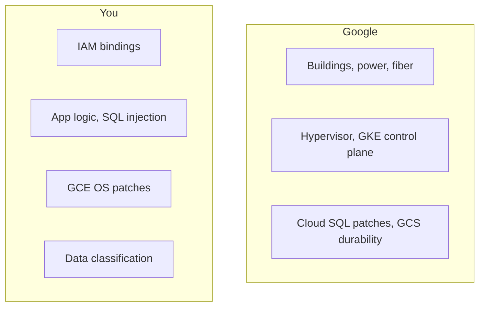

---

## F5 — Compute decision tree

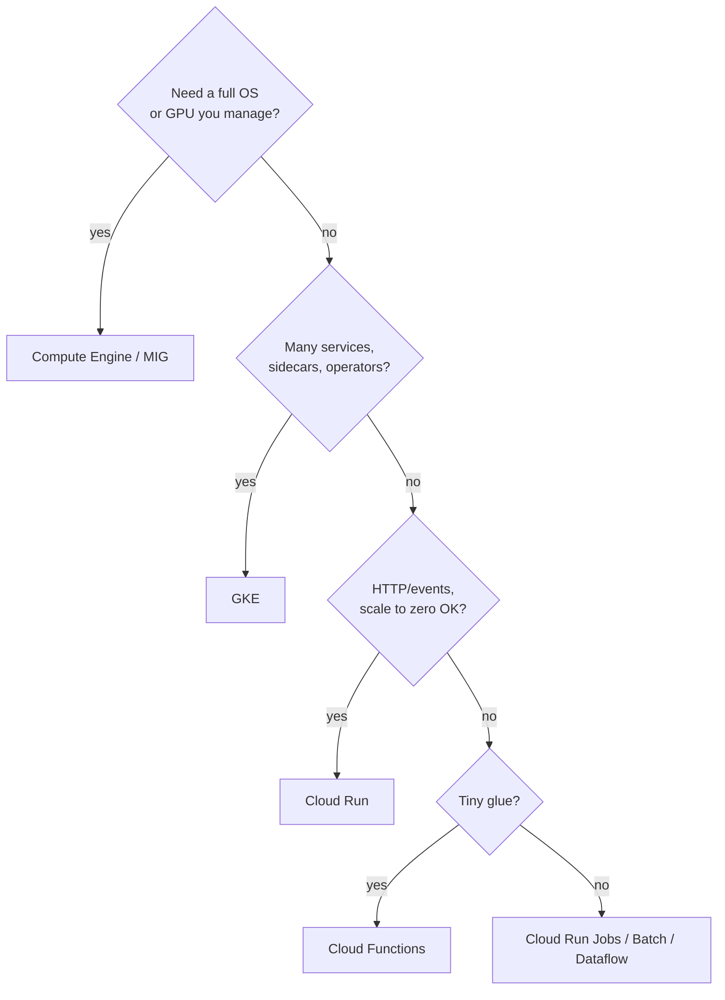

**Say:** “Start at Cloud Run. Move left only when a constraint appears.”

---

## F6 — GCE managed instance group + LB

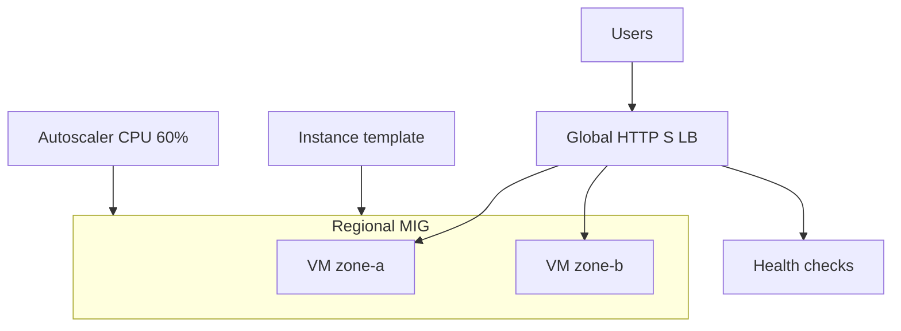

---

## F7 — GKE vs Cloud Run (data plane)

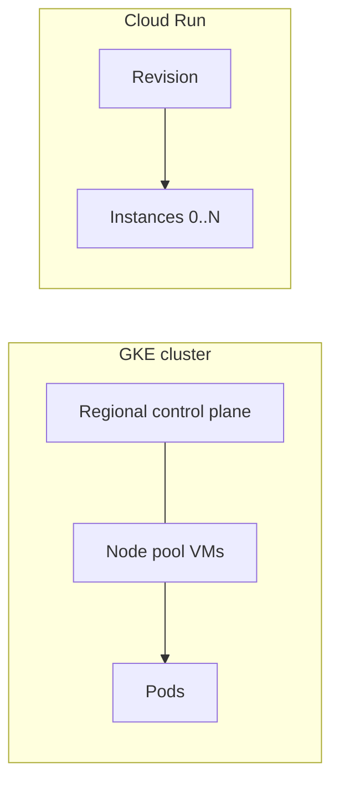

**Say:** “GKE: you still have nodes. Cloud Run: Google maps requests to containers; you do not SSH anywhere.”

---

## F8 — VPC: global VPC, regional subnets

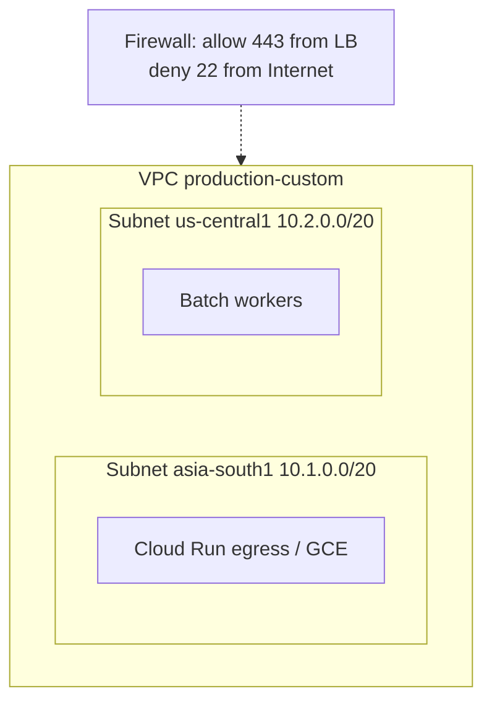

**Say:** “Unlike AWS, this VPC is global. Subnets stay regional. Firewalls are VPC-wide with tags or service accounts.”

---

## F9 — Private VM, NAT, Private Google Access

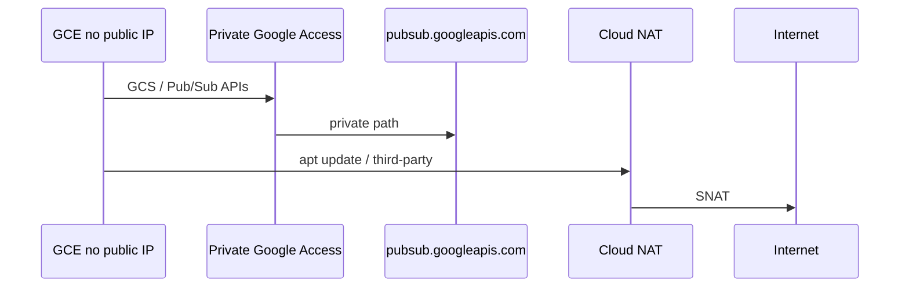

---

## F10 — Load balancer taxonomy

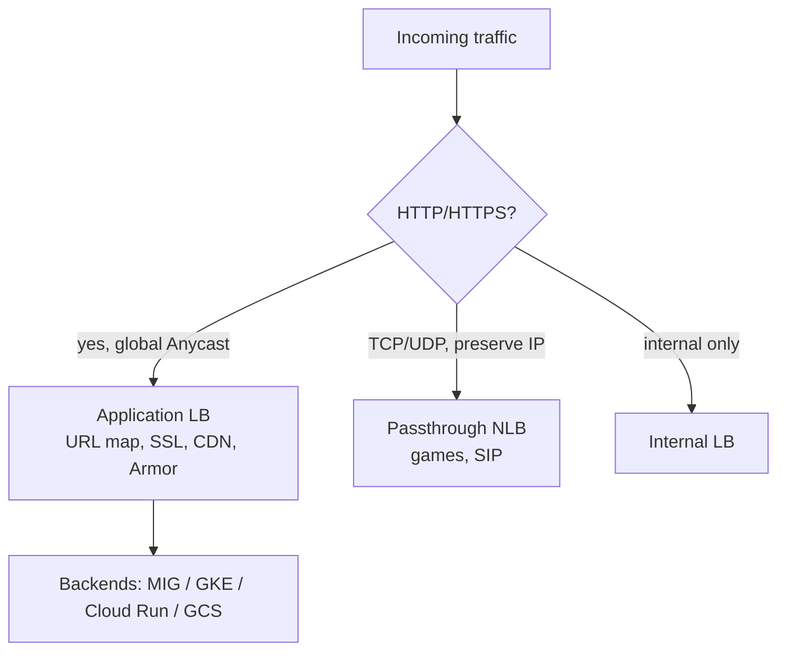

---

## F11 — Storage decision

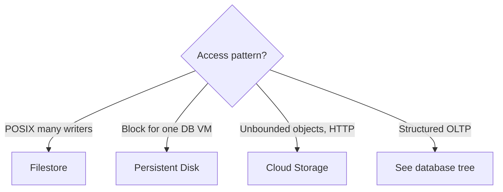

---

## F12 — Database decision tree (core exam figure)

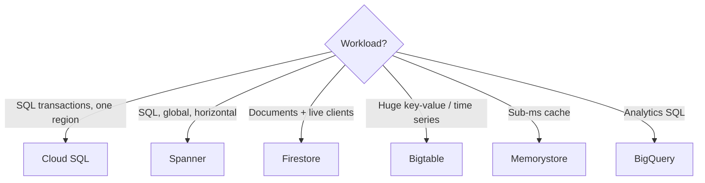

---

## F13 — Spanner TrueTime (intuition, not a clock paper)

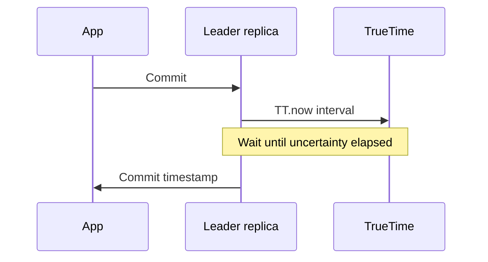

**Say:** “Spanner does not violate physics. It **waits out clock uncertainty** so commit order is globally meaningful.”

---

## F14 — Pub/Sub fan-out (the real-time backbone)

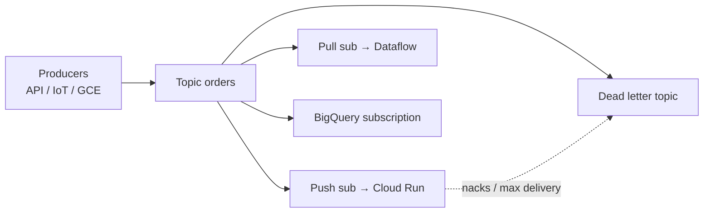

**Say:** “One topic, many independent subscribers. Analytics must not block checkout.”

---

## F15 — At-least-once and idempotency

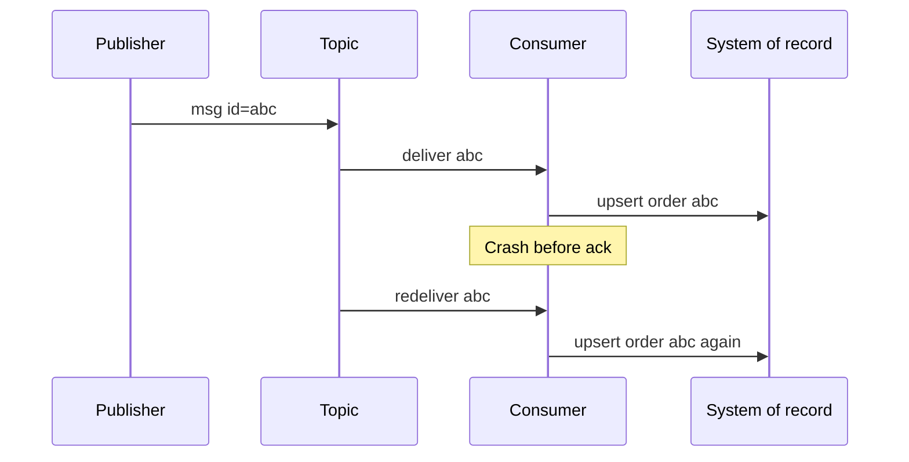

**Say:** “Redelivery is normal. Use idempotency keys in Cloud SQL/Spanner, not ‘hope for exactly once.’”

---

## F16 — Dataflow windows and watermarks

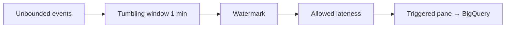

**Say:** “Event time ≠ processing time. Watermarks guess completeness; late data still happens — design for it.”

---

## F17 — BigQuery storage vs compute

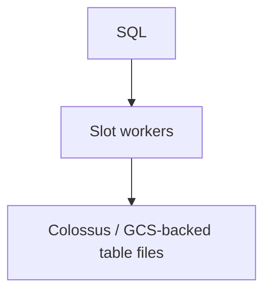

**Say:** “You pay for **bytes scanned** (on-demand) or **slots**. Partition and cluster or you scan the lake.”

---

## F18 — Real-time ML scoring

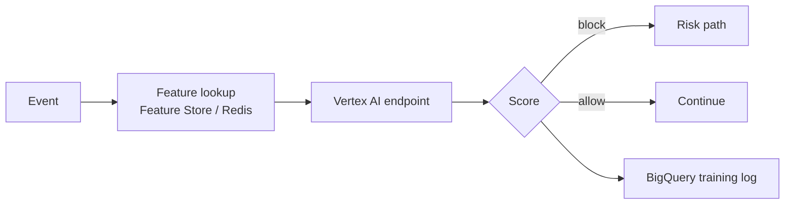

---

## F19 — Observability of a request

```mermaid
flowchart LR
  LB[LB] --> CR[Cloud Run]
  CR --> SQL[Cloud SQL]
  CR --> PS[Publish Pub/Sub]
  PS --> WK[Worker]
  WK --> BQ[BigQuery]
```

```mermaid
sequenceDiagram
  participant U as User
  participant CR as Cloud Run
  participant PS as Pub/Sub
  participant W as Worker
  U->>CR: HTTP trace id=T
  CR->>PS: publish attrs trace=T
  PS->>W: push
  Note over CR,W: One trace in Cloud Trace
```

---

## F20 — CI/CD with federation (no JSON keys)

```mermaid
sequenceDiagram
  participant GH as GitHub Actions
  participant WIF as Workload Identity Federation
  participant AR as Artifact Registry
  participant Run as Cloud Run
  GH->>WIF: OIDC token
  WIF->>GH: short-lived GCP token
  GH->>AR: docker push
  GH->>Run: deploy revision
```

---

## F21 — Threat / trust boundaries

```mermaid
flowchart TB
  Inet[Internet] -->|Armor + IAP + HTTPS| LB
  LB --> Run[Cloud Run]
  Run --> SQL[(Cloud SQL private IP)]
  Run --> SA[Runtime SA]
  SA --> GCS[Bucket private]
  SA --> KMS[KMS decrypt]
```

**Say:** “The service account **is** the identity of the app. If it can `storage.objects.get` on `*`, so can an RCE.”

---

## F22 — Cost heatmap (whiteboard)

Draw a 2×2:

| | Low surprise | High surprise |
|---|---|---|
| **Low $** | Cloud Run scale-to-zero, Pub/Sub | BigQuery `SELECT *`, GCS egress |
| **High $** | Spanner, GPUs (expected) | Idle GKE nodes, unattended MIG |

---

## F23 — Student SaaS reference architecture

```mermaid
flowchart TB
  U[Browser] --> CDN[Cloud CDN]
  CDN --> LB[HTTPS LB + Armor]
  LB --> API[Cloud Run API]
  API --> SQL[(Cloud SQL)]
  API --> GCS[GCS signed URLs]
  API --> PS[Pub/Sub]
  PS --> IDX[Search indexer Cloud Run]
  PS --> ST[Dataflow]
  ST --> BQ[(BigQuery)]
  BI[Looker Studio] --> BQ
```

Use this as the **capstone skeleton**. Every extra box needs a sentence of justification.

---

## F24 — Consistency spectrum (place products)

```mermaid
flowchart LR
  Strong[Strong / external] --> Eventual[Eventual]
  Strong --> SP[Spanner]
  Strong --> SQL[Cloud SQL primary]
  Strong --> FS[Firestore document]
  Eventual --> Cache[Memorystore]
  Eventual --> CDN[Cloud CDN]
  Eventual --> BQ[BigQuery streaming buffer]
```

---

## Slide hygiene

- One figure per slide; font ≥ 18 pt after export.
- Never screenshot the live Console as a “figure” — it dates in months.
- When a product is renamed, keep the **arrows** (who talks to whom); update labels.
