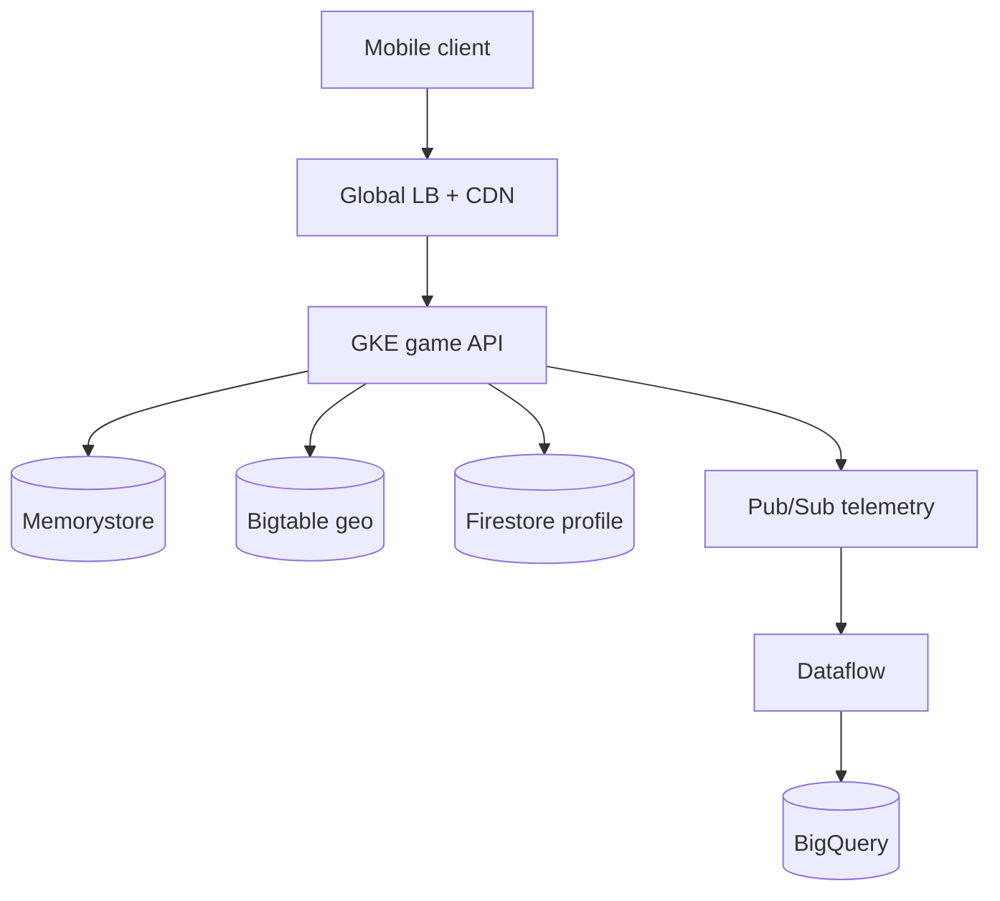
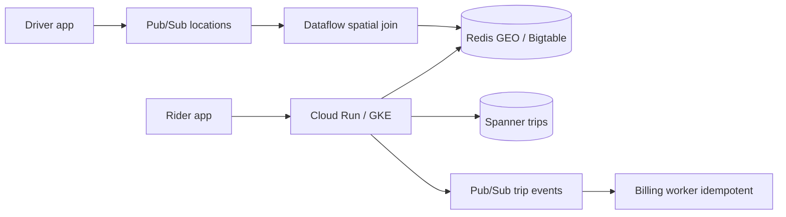
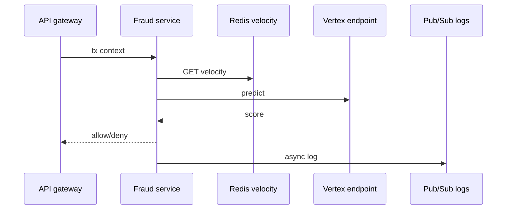
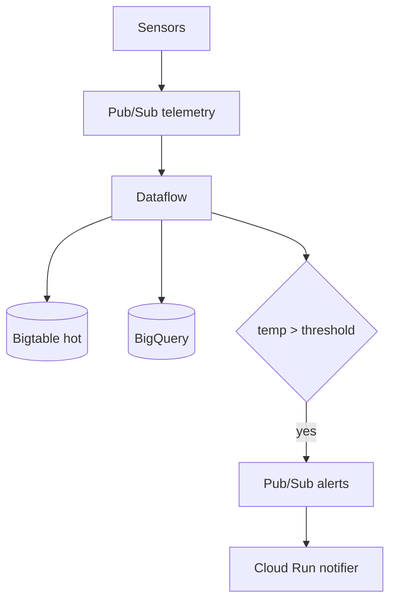
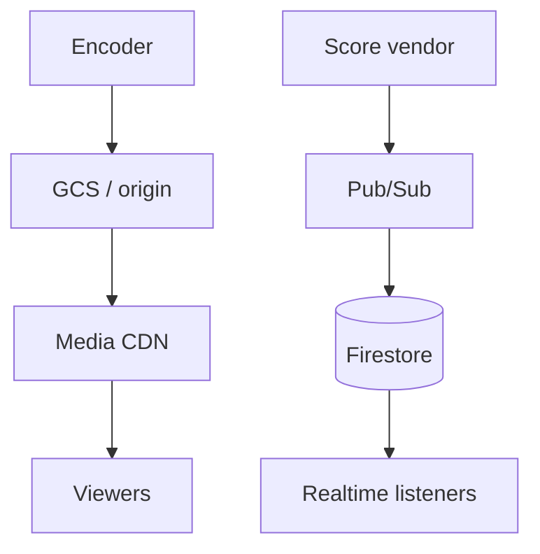
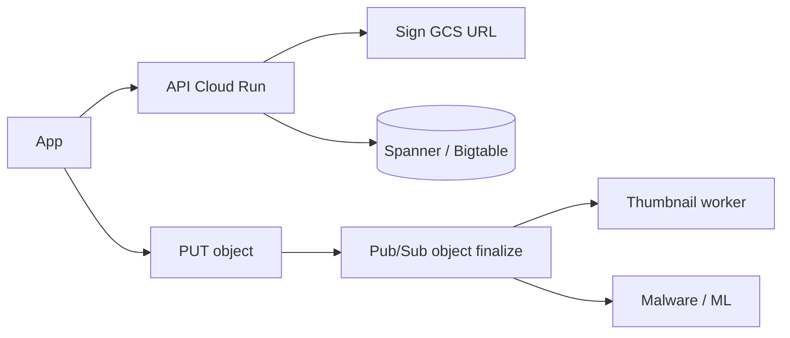
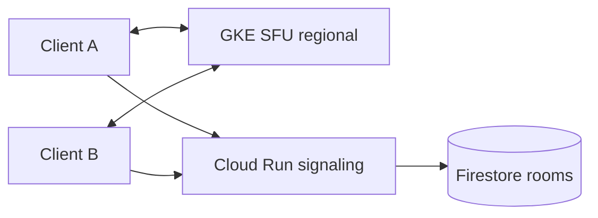

# Real-time use cases (seminar + architecture critiques)

Each case is written for a **45-minute seminar**: context → requirements → GCP mapping → figure → failure modes → student tasks. Public postmortems and engineering blogs evolve; treat vendor names as **illustrative**, not NDAs.

**Definition used in this course:** *real-time* means the system **reacts to events as they occur** with a latency SLO (milliseconds to a few seconds), not a nightly batch. Distinguish:

| Class | Latency SLO | Example |
|---|---|---|
| Hard real-time | Missed deadline = system failure | Not typical in public cloud HTTP |
| Soft / interactive | p99 50–200 ms | Game tick, fraud check |
| Near-real-time | 1–30 s | Dashboard, IoT alert |
| Streaming analytics | minutes | Hourly fraud model refresh |

---

## Case 1 — Live multiplayer / location game (Pokémon GO–style)

### Story

Niantic’s Pokémon GO (2016) is the canonical “GCP + Kubernetes + global spike” teaching story: a client-heavy AR game that **writes player location and encounters** at planetary scale, with **spiky** launches and events.

### Requirements

- Millions of concurrent clients.
- Geo queries: “what is near me?”
- Hot events (community days) → 10× traffic in minutes.
- Cheating / spoofing is an adversarial load generator.

### Mapping

| Need | GCP |
|---|---|
| Stateless game HTTP/gRPC | GKE or Cloud Run behind global LB |
| Session / presence | Memorystore Redis |
| Player profile | Spanner or Datastore/Firestore |
| Spatial / high write telemetry | Bigtable (row key = geohash + time) |
| Assets (textures, maps) | GCS + Cloud CDN |
| Analytics | Pub/Sub → Dataflow → BigQuery |
| Scale | GKE HPA + cluster autoscaler; multi-region if latency demands |

### Figure

### Failure modes

- **Hot geohash** (Times Square) overloads one Bigtable tablet — fix: key salting, load shedding, regional isolation.
- **Fan-out analytics** in the request path — never write BigQuery on the game tick.
- **Cold start** if you naively put the tick on Cloud Run scale-to-zero — keep min instances or use GKE.

### Student tasks

1. Design a Bigtable row key for `cell_id`, `hour`, `player_id` and explain hotspotting.
2. Write an SLO: p99 encounter RPC < 100 ms; list what you measure (SLIs).

---

## Case 2 — Ride-hailing match (Uber-class, GCP-shaped)

### Story

Match riders and drivers in a city with **seconds** of decision time. (Uber’s public stack has been mixed-cloud historically; we **reshape** the problem onto GCP to teach, not to claim their bill of materials.)

### Requirements

- Driver location stream (1–5 s).
- Match algorithm: nearby, ETA, fairness.
- Surge pricing (read-heavy).
- Exactly-once **billing** despite retries.

### Mapping

| Need | GCP |
|---|---|
| Location ingest | IoT Core-like devices or mobile → Pub/Sub |
| Stream join driver↔demand | Dataflow (session windows) or custom GKE workers |
| Current location | Memorystore + Bigtable |
| Trip OLTP | Cloud SQL or Spanner (payments, trip state machine) |
| Dispatch notifications | Firebase Cloud Messaging (survey) + Pub/Sub |
| Fraud | Vertex online prediction on trip features |

### Figure

### Teaching point

The **match** is real-time; **money** is strongly consistent. Do not put payments in Redis.

### Student tasks

Idempotency key = `trip_id + event_type`. Sketch the worker’s `INSERT ... ON CONFLICT`.

---

## Case 3 — Payments fraud scoring (milliseconds)

### Story

Authorize a card: issuer timeout is ~100–250 ms **including** your fraud service.

### Requirements

- p99 < 40 ms inside your VPC.
- Features: device, velocity (tx/10 min), merchant risk.
- Model refresh hourly without downtime.
- Every score logged for regulators.

### Mapping

| Need | GCP |
|---|---|
| Sync path | Cloud Run **min instances** or GKE + Vertex **private endpoint** |
| Velocity counters | Memorystore (INCR with TTL) |
| Profile store | Bigtable or Spanner |
| Async enrichment | Pub/Sub (does not block authorize) |
| Training | BigQuery + Vertex training |
| Canary model | Traffic split on Cloud Run or Vertex endpoint traffic split |

### Figure

### Failure modes

- **Feature store timeout** — fail **open or closed**? Banks often fail closed for high amounts, open for tiny amounts — **policy**, not GCP.
- **Model endpoint cold start** — prohibited; use min replica.
- **Training-serving skew** — same Beam transforms for batch and online.

### Student tasks

Draw a sequence diagram with a 30 ms budget annotated on each hop.

---

## Case 4 — IoT fleet telemetry and alerting (smart campus)

### Story

10,000 campus sensors (HVAC, occupancy, lab safety) publish every 5 s. Facilities need **alerts in < 15 s**; data science wants **years of history**.

### Requirements

- Device identity and rotate credentials.
- Backfill when a building’s WAN dies.
- Alerting without 10k Grafana panels.

### Mapping

| Need | GCP |
|---|---|
| Ingest | Pub/Sub (devices → MQTT bridge or HTTPS) |
| Stream rules | Dataflow or Cloud Functions on push |
| Hot store | Bigtable (`building#sensor#ts`) |
| Cold analytics | BigQuery (partitioned by day) |
| Alert | Monitoring + Pub/Sub → Chat/email |
| Device twins | Firestore |

### Figure

### Teaching point

**Two sinks** from one pipeline: operational (Bigtable) vs analytical (BigQuery). Students often try one database for both and lose.

### Student tasks

Specify window: 1-minute tumbling average vs raw 5 s points for alerts (don’t alert on a single noisy sample).

---

## Case 5 — Live sports / OTT streaming

### Story

A cricket World Cup stream: millions of concurrent viewers, **chat**, **live scores**, **DRM**, and a **highlights** pipeline.

### Mapping

| Need | GCP |
|---|---|
| Origin video | Encoder on GCE GPU or Media CDN ingest |
| Scale delivery | **Media CDN / Cloud CDN** |
| Tokenized URLs | Signed cookies; Cloud Armor |
| Live scores | Pub/Sub → Firestore listeners on mobile |
| Chat | Firestore or third-party; **fan-out** is the problem |
| Highlights | Eventarc / Pub/Sub → Cloud Run transcode → GCS |

### Figure

### Failure modes

- Chat in a single Firestore collection = hotspot. **Shard** rooms.
- Origin in one region + global viewers = cost and rebuffering. Use multi-region + CDN.

---

## Case 6 — Collaborative document / presence (Google Docs–class)

### Story

Many editors, operational transformation or CRDTs, presence cursors. Google’s own Docs is not “you rebuild Docs on Firestore,” but **Firestore real-time listeners + a GKE collab service** is a teaching approximation.

### Mapping

- **Source of truth:** Spanner or a collab engine on GKE.
- **Presence:** Firestore or Memorystore pub/sub channels.
- **Search:** Pub/Sub → indexer.
- **Blobs:** GCS.

### Teaching point

Realtime UX ≠ one database. **Sync protocol** is the hard CS; GCP only hosts it.

---

## Case 7 — Social media ingest (Snap / Twitter-class)

### Story

Public engineering: Snap’s early GCP usage (GCS, Bigtable, BigQuery) is a standard case. High **write** ingest, **asymmetric** read (celebrities).

### Mapping

| Path | System |
|---|---|
| Media upload | Signed URL → GCS (never through API RAM) |
| Metadata | Bigtable / Spanner |
| Fan-out feed | Precompute vs fan-out on read (CS classic) |
| Trends | Dataflow windows |
| Abuse | Async ML on Pub/Sub |

### Figure

### Student tasks

Explain why **direct-to-GCS** beats `multipart` through Cloud Run (memory, timeout, cost).

---

## Case 8 — Clickstream and personalization (Spotify / retail)

### Story

Every play/pause/skip is an event. Recommendations must update in **near-real-time** (next session), not next week.

### Mapping

- Pub/Sub clickstream.
- Dataflow sessionization (session windows by `user_id`).
- BigQuery for training sets.
- Vertex + Feature Store for **next-track** online features.
- Experimentation: Cloud Run traffic split (A/B).

### Teaching point

**Session windows** in Beam are the CS content; GCP is the runner.

---

## Case 9 — Global chat / customer support copilot

### Requirements

- Message order **per conversation**.
- Typing indicators (lossy OK).
- LLM assist with **RAG** over tickets (latency 1–3 s OK).
- PII redaction before the model.

### Mapping

| Need | GCP |
|---|---|
| Ordered messages | Pub/Sub **ordering keys** = `conversation_id` **or** Spanner |
| Presence | Memorystore |
| RAG corpus | GCS + Vertex Vector Search / Embedding API |
| LLM | Vertex Gemini; **VPC-SC** in regulated orgs |
| Audit | BigQuery + Cloud Logging |

### Failure modes

Pub/Sub ordering keys **reduce throughput** — do not use one key for the whole company.

Prompt injection from customer tickets: **treat retrieved docs as hostile**.

---

## Case 10 — Market data dashboard (fintech teaching)

### Requirements

- Ticks in **< 1 s** to UI.
- Official books of record **cannot** be the dashboard store.
- Replay for audit.

### Mapping

Exchange → Pub/Sub → Dataflow (watermarks) → Bigtable (hot) + BigQuery (cold). UI: **Server-Sent Events** from Cloud Run subscribed to a **filtered** topic, or Firestore for the last price only.

**Never** teach students to bind a browser to the raw tick topic.

---

## Case 11 — Campus emergency / disaster notification

### Requirements

- Geo-targeted push in **seconds**.
- Do not DDoS your own APIs.
- Audit who was notified.

### Mapping

Pub/Sub → fan-out workers with **rate limits**. FCM for mobile. BigQuery for after-action reports. Cloud Armor on public status page (cached GCS).

**Ethics:** location privacy, consent, false-alarm cost.

---

## Case 12 — Video conferencing SFU (Zoom-class, simplified)

WebRTC **Selective Forwarding Unit** on GCE/GKE with **regional** proximity. Signaling on Cloud Run + Firestore. Recording: mixer → GCS → Speech-to-Text (batch).

**Teaching point:** real-time media is **UDP, regional, CPU**. Global Anycast HTTP LB is the wrong tool for media packets; use regional NLB / passthrough.

---

## Cross-cutting comparison (print this)

| Case | Ingest | Hot store | SoR | Stream compute | UX push |
|---|---|---|---|---|---|
| Game | HTTPS | Bigtable + Redis | Firestore/Spanner | Dataflow | Client poll / push |
| Rides | Pub/Sub | Redis GEO | Spanner | Dataflow | Push notify |
| Fraud | Sync RPC | Redis | Spanner/SQL | Batch BQ | — |
| IoT | Pub/Sub | Bigtable | — | Dataflow | Alerts |
| OTT | Encoder | CDN | — | Transcode jobs | Firestore scores |
| Social | GCS + API | Bigtable | Spanner | Dataflow | Fan-out |
| Chat | HTTPS | Redis | Spanner | — | Listeners |
| Market | Pub/Sub | Bigtable | SQL | Dataflow | SSE |

**SoR** = system of record.

---

## How to run a seminar (faculty)

1. Show F14 (Pub/Sub) first — it appears in almost every case.
2. Ask: “What is the **synchronous** path vs **asynchronous** path?”
3. Ask: “What happens if Pub/Sub is down for 5 minutes?” (buffer on device, degrade UX, do not lose money).
4. Grade architectures on **failure modes**, not number of GCP logos.

---

## Suggested readings (assign 1–2, not 12)

- Google SRE Book — chapters on SLOs and load shedding (free).
- Apache Beam programming guide — windows and watermarks.
- Spanner: *J.C. Corbett et al.*, OSDI 2012 (TrueTime) — excerpt only.
- Faculty should refresh: Google Cloud Architecture Framework (current year).
