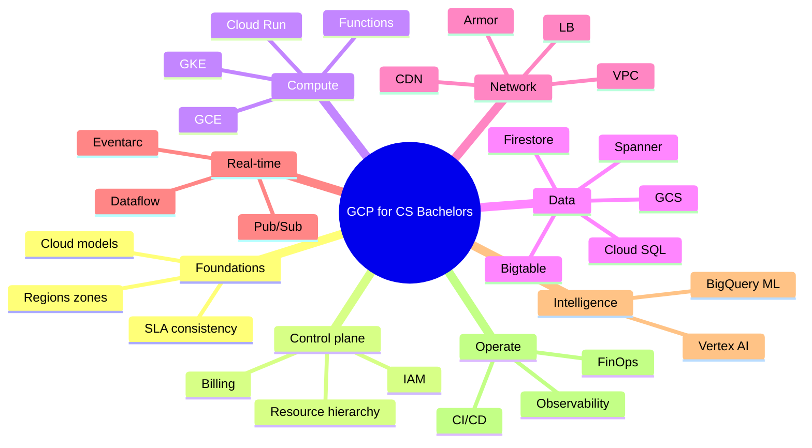

# Google Cloud Platform — Bachelor of Computer Science

A complete teaching pack for a **12-week, 3-credit** undergraduate course. Students learn cloud concepts, GCP services, architecture patterns, cost/security trade-offs, and **real-time production architectures**.

| Item | Value |
|---|---|
| Level | B.Sc. / B.Tech. Computer Science (Year 2–3) |
| Prerequisites | OS, networks (TCP/IP, DNS, HTTP), databases, basic Linux, one programming language |
| Outcomes | Design, deploy, observe, and cost a GCP application; explain trade-offs vs AWS/Azure |
| Contact hours | 36 lecture + 24 lab (adjust to your calendar) |

## How to use this pack

| File | Audience | Purpose |
|---|---|---|
| [00-instructor-guide.md](00-instructor-guide.md) | Faculty | Week plan, pedagogy, assessment, demo setup |
| [01-lecture-notes.md](01-lecture-notes.md) | Students + faculty | Full theory notes (print or LMS) |
| [02-figures-and-diagrams.md](02-figures-and-diagrams.md) | Slides / whiteboard | Mermaid figures ready for lecture |
| [03-realtime-usecases.md](03-realtime-usecases.md) | Case seminars | Production-style real-time systems |
| [04-lab-manual.md](04-lab-manual.md) | Lab sessions | Hands-on exercises (free-tier friendly) |
| [05-assessments.md](05-assessments.md) | Exams | Quizzes, midterm, project, viva |

Render diagrams in GitHub, VS Code (Mermaid), or [mermaid.live](https://mermaid.live).

## Learning outcomes (Bloom)

By the end of the course a student can:

1. **Explain** IaaS / PaaS / SaaS / FaaS and map each to GCP products.
2. **Navigate** organizations → folders → projects → resources and apply IAM least privilege.
3. **Provision** compute (GCE, GKE, Cloud Run, Cloud Functions) and justify the choice.
4. **Design** VPC networks, load balancing, and private connectivity.
5. **Select** storage and databases using consistency, latency, and cost criteria.
6. **Build** event-driven and streaming pipelines (Pub/Sub, Dataflow, BigQuery).
7. **Instrument** apps with Cloud Logging, Monitoring, Trace, and Error Reporting.
8. **Apply** security controls (IAM, Secret Manager, CMEK, VPC-SC, Cloud Armor).
9. **Estimate** cost (CUDs, committed use, BigQuery slots vs on-demand).
10. **Critique** real-time architectures used in industry (gaming, IoT, fraud, media).

## Topic map

